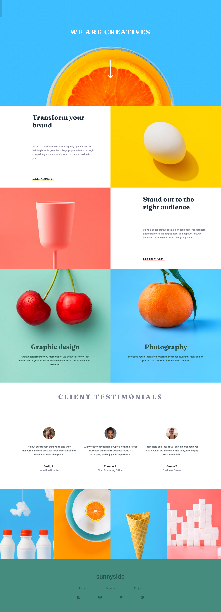

# Frontend Mentor - Sunnyside agency landing page solution

This is a solution to the [Sunnyside agency landing page challenge on Frontend Mentor](https://www.frontendmentor.io/challenges/sunnyside-agency-landing-page-7yVs3B6ef). Frontend Mentor challenges help you improve your coding skills by building realistic projects.

## Table of contents

- [Frontend Mentor - Sunnyside agency landing page solution](#frontend-mentor---sunnyside-agency-landing-page-solution)
  - [Table of contents](#table-of-contents)
  - [Overview](#overview)
    - [The challenge](#the-challenge)
    - [Screenshot](#screenshot)
    - [Links](#links)
  - [My process](#my-process)
    - [Built with](#built-with)
    - [What I learned](#what-i-learned)
    - [Useful resources](#useful-resources)
  - [Author](#author)

## Overview

### The challenge

Users should be able to:

- View the optimal layout for the site depending on their device's screen size
- See hover states for all interactive elements on the page

### Screenshot



### Links

- [Code Source](https://github.com/zougari47/sunnyside-agency-landing-page)
- [Live Demo](https://zougari47.github.io/sunnyside-agency-landing-page/)

## My process

### Built with

- HTML
- CSS
- JavaScript
- [Bootstrap 5](https://getbootstrap.com/)
- Mobile-first workflow

### What I learned

This was a really good challenge to test my responsive skills, I spend a lot of time on it because I give attention to the details.

I use img tag for a gallery pictures but i have to change images in medium screen, I realise after that the best thing to do is to use picture tag.

But I love how I do it with JavaScript ;

```js
const imgs = document.querySelectorAll('.img_gallery');

function changeImg() {
  imgs.forEach((img) => {
    window.matchMedia('(min-width: 758px)').matches
      ? (img.src = img.dataset.src.replace('mobile', 'desktop'))
      : (img.src = img.dataset.src.replace('desktop', 'mobile'));
  });
}
```

### Useful resources

- [Bootstrap Documentation](https://getbootstrap.com/docs/5.1/getting-started/introduction/) - This helped me for using bootstrap. I really liked this framework, it really help you to make responsive layout quickly.

## Author

- CodePen - [@zougari47](https://codepen.io/zougari47)
- Frontend Mentor - [@zougari47](https://www.frontendmentor.io/profile/zougari47)
- Twitter - [@zougari47](https://www.twitter.com/zougari47)
